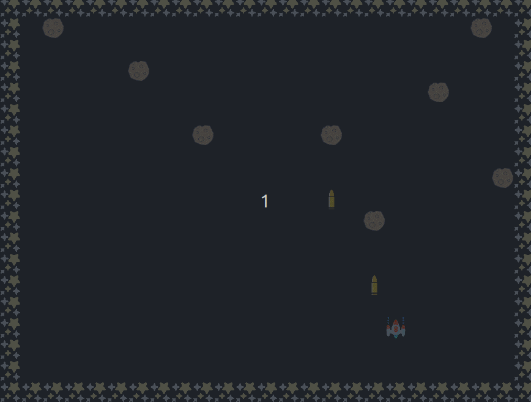
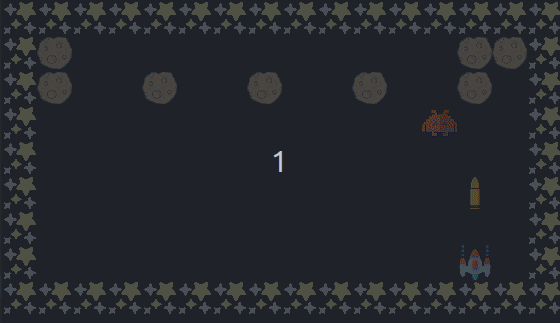
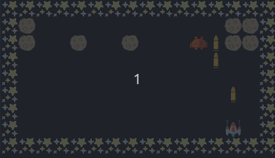

# Space Invaders

This repository contains the problem statements, starter code, and test cases for students to work on. Each subdirectory focuses on a specific set of AI techniques, providing practical challenges to enhance understanding and application skills.

---

## Directory Structure

```plaintext
/
├── SearchSpaceInvader/        # Challenges on search algorithms
└── MultiagentSpaceInvader/    # Challenges on multi-agent decision-making
```
---

## Some GIFs of the game
Here are some of the gifs of the game.




---

## **Tech Stack**

- **Python**: Used as the primary programming language for implementing the game's logic and features.  
- **Pygame**: A library utilized for handling graphics, animations, and real-time event processing.  

---